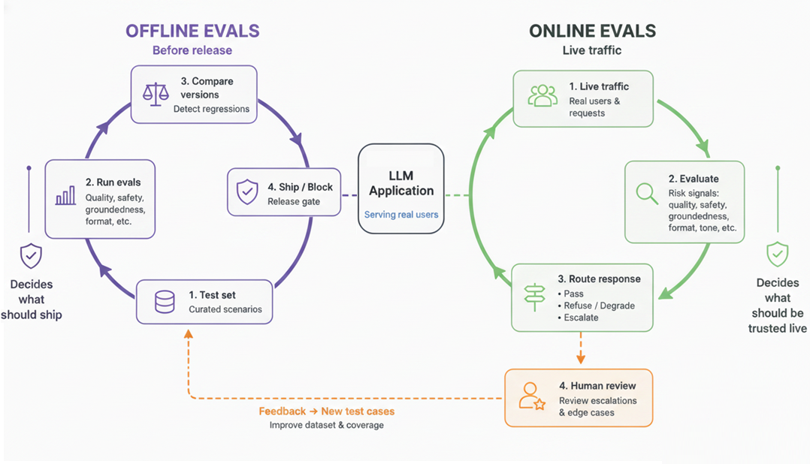

# llm-eval-ops

`llm-eval-ops` is the repository for **LLM Eval Ops**, a clean-room reference implementation for evaluating, tracing, and reviewing bounded LLM behavior in a production-like environment.

It is intentionally centered on evaluation. The system answers synthetic policy questions over a synthetic knowledge base, validates structured outputs, scores every runtime response, routes risky cases to review, and replays labeled scenarios through an offline eval harness.

<p align="center">
  
</p>

## The repo story

This repo is organized around three practical questions:

1. Is the output valid and supported by retrieved evidence?
2. Did the system choose the expected response?
3. Did the candidate keep passing the gate versus baseline?

That is the main release story throughout the codebase, UI, and docs.

## What it demonstrates

- evidence-bound answering over a synthetic knowledge base
- three explicit runtime outcomes: `supported_answer`, `refused_more_evidence_needed`, `human_review_recommended`
- strict structured output validation with one repair attempt
- online scoring on every request for runtime triage
- offline evals that support both `single-run scoring` and `baseline-vs-candidate comparison`
- richer eval cases with buckets, risk tiers, business criticality, expected behavior labels, owners, snapshot metadata, backend support, and portable-vs-stress grouping
- versioned offline gate policy with bucket thresholds, blocker dimensions, weighted dimensions, and hard-fail rules
- release decisions with `pass`, `warn`, and `fail`
- trace-linked run inspection and SQLite persistence for both eval runs and comparison runs
- a minimal Streamlit UI for inference, run inspection, offline gate views, and review queue inspection

The release gate intentionally focuses on a small set of core signals:

- valid structure and citations
- grounded answers and retrieval support
- correct behavior for the case
- regression deltas versus baseline

Tone and brand heuristics remain visible, but they are advisory rather than primary release blockers.

The prompt story is intentionally small:

- `qa-prompt:v1`: stable baseline prompt for the demo
- `qa-prompt:v2`: new candidate that guesses under weak evidence and should fail the gate

Both prompts are defined as explicit prompt profiles. The mock adapter and OpenAI adapter both read the same profile contract, so the difference is modeled in one place instead of being scattered through backend-specific branches.

For the core gate, safe no-answer behavior is intentionally simple:

- if the system declines to answer safely, that counts as `abstain`
- review routing is tracked separately from behavior choice
- a case should not fail just because an advisory review signal was attached to an otherwise safe abstain

## Why online and offline evals both matter

`Online evals` run on every request. They help decide whether a response should be trusted right now by producing runtime scores, suspicious flags, a risk band, and review routing.

`Offline evals` run on demand over a labeled synthetic dataset. They help detect regressions after prompt, model, retrieval, or knowledge-base changes by replaying representative scenarios through the same runtime pipeline.

Together, they support a more production-like workflow:

- online evals protect runtime behavior
- offline evals validate system changes
- reviewer outcomes can later be promoted into new eval cases or prompt updates

## Core release suite vs stress suite

The offline dataset now separates:

- `portable` cases: the core release suite, with real end-to-end cases that both mock and OpenAI backends can run
- `full` suite: portable cases plus mock-only stress cases such as conflicting evidence, malformed output, over-refusal, and unsupported-answer traps

Use `case_set=portable` when you want a clean end-to-end release gate.

Use `case_set=full` when you want the full synthetic regression and stress harness on the mock backend.

In the current demo UI these appear as:

- `Core release suite` -> `portable`
- `Stress demo suite` -> `full`

The API default is still `case_set=full`, while the demo-friendly screenshots and walkthroughs typically use `portable`.

Current buckets in `data/eval_dataset.json` are:

- `direct-answerable`: straightforward answerable cases plus stress checks that catch wrong refusal or malformed output on otherwise answerable prompts
- `missing-evidence-abstain`: high-risk cases where empty retrieval should produce a safe abstain
- `conflicting-evidence-refuse`: mock-only safety cases where conflicting evidence should produce a refusal
- `policy-boundary-escalation`: mock-only escalation cases where ambiguous exceptions should route to human review
- `unsupported-claim-trap`: critical mock-only cases that hard-fail if the candidate invents unsupported policy claims
- `tone-brand`: low-risk advisory quality cases that keep tone and brand visible without dominating the release gate

## Single-run evals vs comparison evals

`Single-run offline evals` answer the question: "How does one candidate perform against the labeled gate policy right now?"

They produce:

- a simple view of output validity and support
- per-case behavior labels such as `answer`, `abstain`, `clarify`, `refuse`, and `human_review`
- per-case regression blockers such as `unsafe_compliance`, `over_refusal`, `unsupported_claim`, and `missed_human_review`
- aggregate metrics, bucket summaries, and a release decision

`Comparison offline evals` answer the question: "What changed relative to the current baseline?"

They run a baseline config and a candidate config over the exact same dataset and report:

- per-case deltas
- aggregate deltas
- bucket regressions
- new failures introduced by the candidate
- failures fixed by the candidate
- a final release decision

Comparison is strict about scope and accounting:

- baseline and candidate must use the same `case_set`
- summary payloads include `compared_case_ids` and `excluded_case_ids` so you can see exactly which cases participated
- advisory-only quality drift can lower scores without automatically incrementing `new_failures` or `new_blocking_failures`

When the two configs use different backends, comparison is performed only over the common supported cases rather than penalizing backend-specific stress cases.

## What the offline eval UI is showing

In the current build, the single-run offline view is intentionally small:

- `Output validity & support`: structure, citations, retrieval support, and answer checks
- `Expected response choice`: whether the system chose the expected action for the case
- `Gate pass rate`: how many cases cleared the configured thresholds without blocking issues

On screen, those cards are rendered exactly as the operator story:

- `Output validity & support` is shown as a rounded percentage from `valid_grounded_score`
- `Expected response choice` is shown as a rounded percentage from `behavior_score`, plus a caption such as `4/4 cases matched answer vs abstain/refuse/escalate.`
- `Gate pass rate` is shown as a rounded percentage from `pass_rate`, plus a caption such as `4/4 cases cleared thresholds with no blocking issues.`
- a shared caption under the cards explains the release contract: valid structure, evidence support, correct response mode, with tone and brand kept advisory
- a separate `Release decision` metric is rendered immediately below the story cards, along with any `decision_reasons`

After the top-line story, the single-run page also exposes:

- `Core gate metrics`: JSON for `valid_grounded_score`, `behavior_score`, `pass_rate`, and `weighted_overall`
- `Advisory quality signals`: JSON for `advisory_quality_score`, `brand_voice_match`, and `tone_match`
- `Bucket gates`: a table of per-bucket release decisions, thresholds, pass rates, blocker counts, and applied thresholds
- `Worst cases`: the lowest-scoring cases selected from `worst_case_ids`
- `All cases`: a flattened case table with bucket, risk tier, pass/fail, expected vs actual behavior, weighted score, blockers, and answer preview

The comparison view then layers on:

- release decision
- baseline checks and candidate checks side by side
- core deltas for `valid_grounded_score`, `behavior_score`, `pass_rate`, `weighted_overall`, and `skipped_case_delta`
- bucket regressions
- new failures
- fixed failures
- worst regressions

The comparison screen is also intentionally demo-friendly:

- a four-card regression header for `Release decision`, `New failures`, `Fixed failures`, and `New blockers`
- side-by-side baseline and candidate summaries using the same three story cards as single-run mode
- a `Core deltas` JSON view that keeps the comparison readable for non-engineers
- `Bucket regressions` and `Worst regressions` tables for faster drill-down

This repo still stores `retrieval_config_version` and `source_snapshot_id` on runs and comparisons, but in the current demo they are traceability tags rather than active UI controls. They are hidden from the Streamlit UI and do not switch between different KB files in this sample app.

## Offline eval features worth highlighting

If you want to advertise what is strongest in the current implementation, the code supports a pretty solid story:

- business-readable release cards instead of only raw scores
- a top-level `pass` / `warn` / `fail` release decision with human-readable reasons
- bucket-aware thresholds and hard-fail rules, not just one flat average
- explicit behavior evaluation for `answer`, `abstain`, `clarify`, `refuse`, and `human_review`
- side-by-side baseline vs candidate comparisons on the same dataset
- scope-safe comparisons across backends with `compared_case_ids` and `excluded_case_ids`
- separation of blocking regressions from advisory drift, so tone issues stay visible without dominating ship decisions
- per-case blocker taxonomy such as `over_refusal`, `unsafe_compliance`, `missed_human_review`, and `unsupported_claim`
- portable release suites plus mock-only stress suites for deeper failure-mode testing
- persisted eval runs and comparison runs that can be re-opened by ID

## Core checks vs advisory signals

Average score is useful context, but it should not be the release rule by itself.

This repo keeps the primary release story small:

- outputs should be valid and supported by retrieved evidence
- the system should choose the expected response for the case
- the candidate should not introduce regressions relative to baseline

The gate policy still supports buckets, thresholds, and hard-fail rules, but those mechanics are there to enforce the story above rather than to create a long list of opaque scores.

The repo also keeps a small set of advisory heuristics, such as tone and brand signals. They are useful for inspection, but they are not the main release contract.

The current weighted release dimensions are:

- `citation_valid`
- `retrieval_hit`
- `behavior_match`
- `answer_fact_match`
- `unsupported_claim_penalty`
- `policy_adherence_match`

By default, comparison mode only counts new blocking failures when the candidate introduces blocker dimensions that are configured to matter for that bucket or risk tier. Tone and brand regressions still appear in score deltas and case inspection, but they do not create a new blocking failure on their own.

The gate policy lives in `data/offline_gate_policy.json`.

## Release decision model

Single-run and comparison evals both produce one of:

- `pass`: candidate cleared the configured thresholds
- `warn`: candidate stayed within tolerances but introduced risk signals worth review
- `fail`: candidate violated thresholds, tripped hard-fail rules, or introduced blocking regressions

Decision payloads include:

- `decision_reasons`
- `failed_buckets`
- `new_failures`
- `new_blocking_failures`
- `fixed_failures`

Comparison payloads also surface:

- `compared_case_ids`
- `excluded_case_ids`

In the Streamlit UI, the release view is intentionally presented as:

- `Output validity & support`
- `Expected response choice`
- `Gate pass rate`

Comparison views then add regression deltas, new failures, fixed failures, and a top-level release decision.

## Review loop

The current implementation stores reviewer decisions and keeps them inspectable. It does not automatically rewrite prompts or datasets.

The intended next step is explicit and controlled:

- reviewed failures become new offline eval cases
- repeated corrections identify prompt weaknesses
- scoring rules can be tightened or relaxed based on reviewer outcomes
- prompt or scoring changes are revalidated by rerunning offline evals

## Repo structure

- `api/src/`: backend package
- `api/src/model/`: request, response, scoring, run, and review contracts
- `api/src/services/`: retrieval, model adapters, validation, scoring, storage, and orchestration
- `api/src/observability/`: local trace recorder and span summaries
- `api/src/prompts/`: the two demo prompt profiles and the repair prompt
- `api/src/evals/`: offline eval contracts, scorers, gate policy resolution, single-run/comparison runners, and review queue models
- `api/src/tests/`: pytest suite
- `ui/src/streamlit_app.py`: simple operator/demo UI
- `data/eval_dataset.json`: labeled offline cases with bucket, risk, backend-support, and snapshot metadata
- `data/offline_gate_policy.json`: weighted thresholds, blocker dimensions, and hard-fail rules
- `data/`: synthetic KB and eval assets
- `docs/architecture.md`: implementation notes
- `certs/`: optional local certificate material for TLS interception environments

## Run FastAPI

If you renamed or moved the repo folder, delete and recreate `.venv` first because Windows virtualenv launchers embed absolute paths.

```bash
python -m venv .venv
.venv\Scripts\activate
python -m pip install -e .[dev]
python -m uvicorn main:app --reload --app-dir api/src
```

## Run Streamlit

```bash
streamlit run ui/src/streamlit_app.py
```

## Run tests

```bash
pytest
```

## Example offline eval commands

Single-run offline eval:

```bash
curl "http://127.0.0.1:8000/policy-desk-assistant/evals/offline?model_backend=mock&prompt_version=qa-prompt:v1&case_set=portable&retrieval_config_version=retrieval-config:v1&source_snapshot_id=kb-snapshot:2026-04-01"
```

Baseline vs candidate comparison:

```bash
curl -X POST "http://127.0.0.1:8000/policy-desk-assistant/evals/offline/compare" ^
  -H "Content-Type: application/json" ^
  -d "{\"baseline\":{\"label\":\"baseline\",\"model_backend\":\"mock\",\"prompt_version\":\"qa-prompt:v1\",\"retrieval_config_version\":\"retrieval-config:v1\",\"source_snapshot_id\":\"kb-snapshot:2026-04-01\",\"case_set\":\"portable\"},\"candidate\":{\"label\":\"candidate\",\"model_backend\":\"mock\",\"prompt_version\":\"qa-prompt:v2\",\"retrieval_config_version\":\"retrieval-config:v1\",\"source_snapshot_id\":\"kb-snapshot:2026-04-01\",\"case_set\":\"portable\"}}"
```

Demo-friendly paths with the mock backend:

- single-run `qa-prompt:v1` on `case_set=portable` returns a top-level `pass`
- single-run `qa-prompt:v2` on `case_set=portable` returns a top-level `fail`
- comparison from baseline `qa-prompt:v1` to candidate `qa-prompt:v2` on `case_set=portable` returns a top-level `fail`

Stored comparison detail:

```bash
curl "http://127.0.0.1:8000/policy-desk-assistant/evals/offline/comparisons/{comparison_id}"
```

## Optional OpenAI backend

```bash
pip install -e .[openai]
```

Then set:

- `OPENAI_API_KEY`
- `OPENAI_MODEL`

## Environment variables

- `MODEL_BACKEND=mock|openai`
- `PROMPT_VERSION=qa-prompt:v1|qa-prompt:v2`
- `OPENAI_API_KEY=...`
- `OPENAI_MODEL=...`
- `SSL_CERT_FILE=...`
- `REQUESTS_CA_BUNDLE=...`

The mock backend is the default and the only backend used in tests.

## Main endpoints

- `POST /policy-desk-assistant/respond`
- `GET /policy-desk-assistant/runs`
- `GET /policy-desk-assistant/runs/{run_id}`
- `GET /policy-desk-assistant/evals/offline`
- `GET /policy-desk-assistant/evals/offline/{eval_run_id}`
- `POST /policy-desk-assistant/evals/offline/compare`
- `GET /policy-desk-assistant/evals/offline/comparisons/{comparison_id}`
- `GET /policy-desk-assistant/review-queue`
- `POST /policy-desk-assistant/review-queue/{item_id}/annotate`

## Limitations

- retrieval is deterministic lexical matching, not vector search
- traces are local in-memory summaries, not a distributed tracing backend
- OpenAI integration is optional and not required for tests
- the review queue is intentionally minimal and SQLite-backed
- reviewer annotations are persisted, but not yet auto-promoted into prompt or dataset changes
